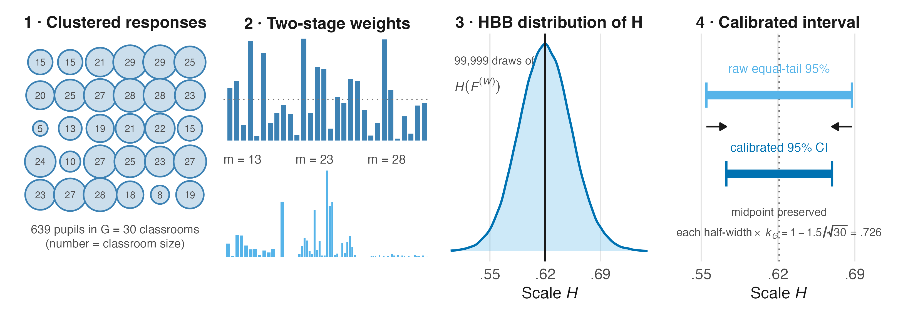
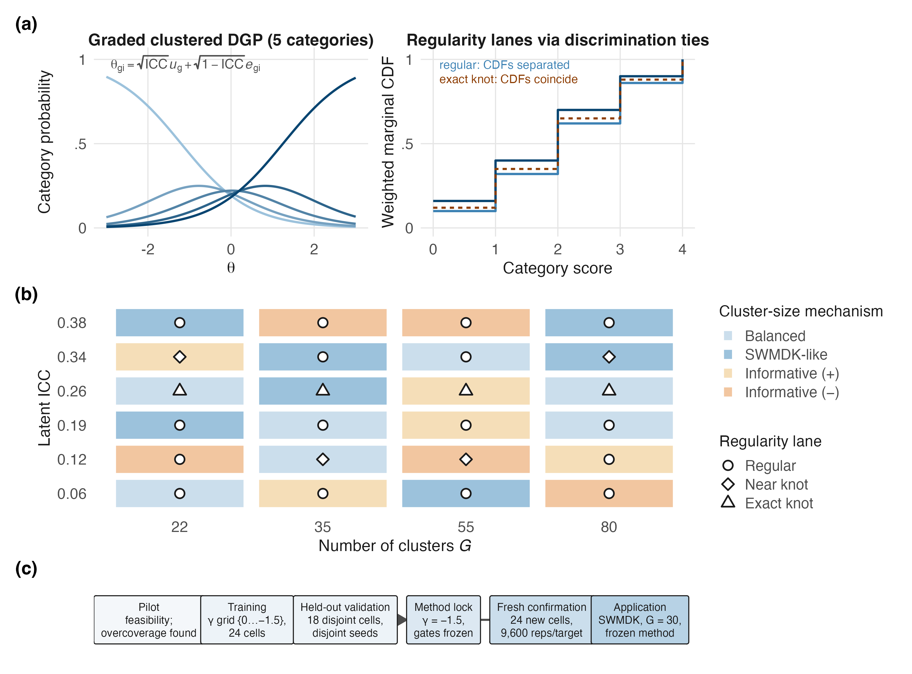
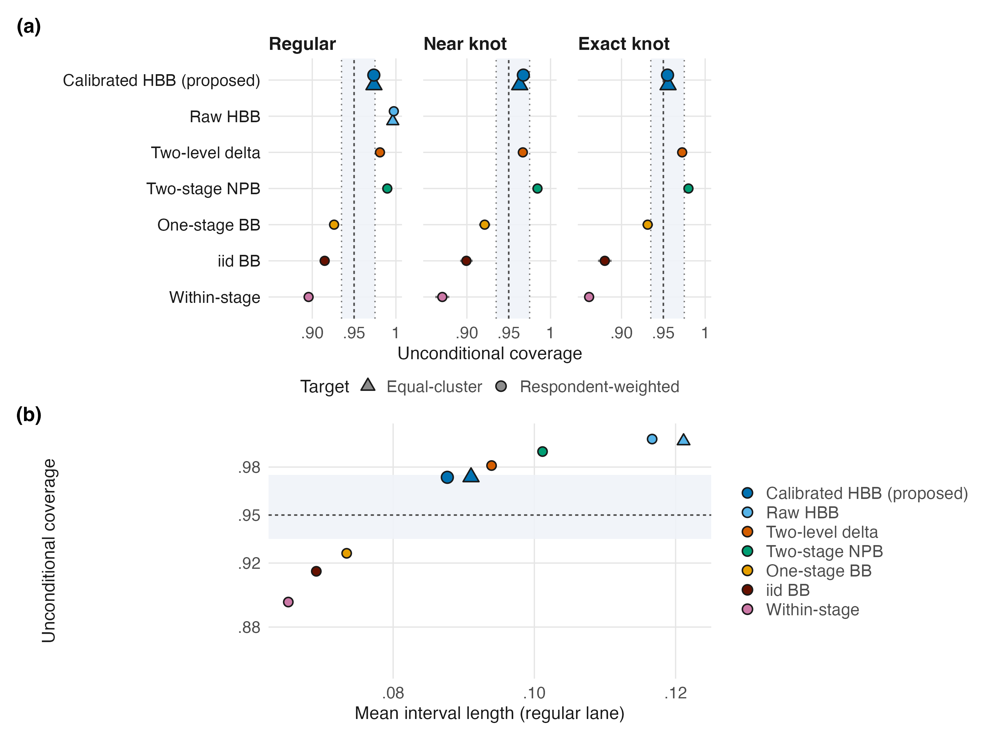
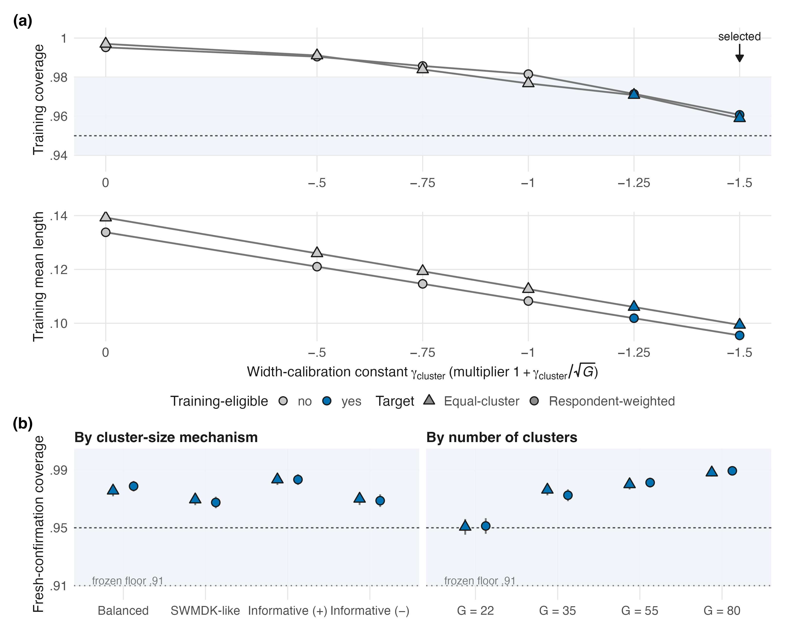
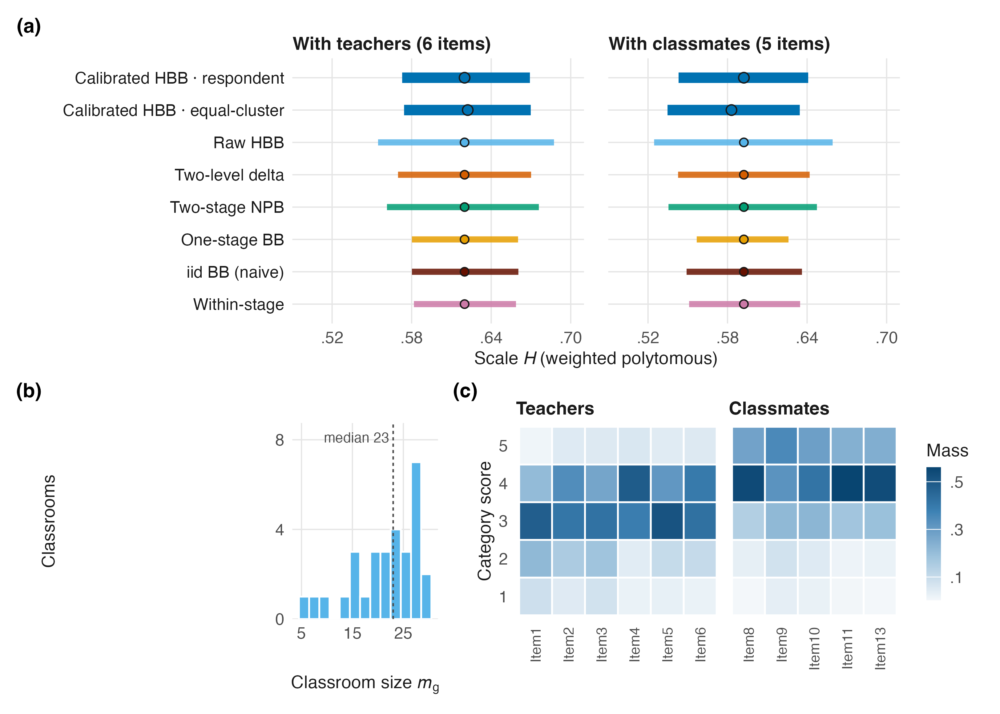
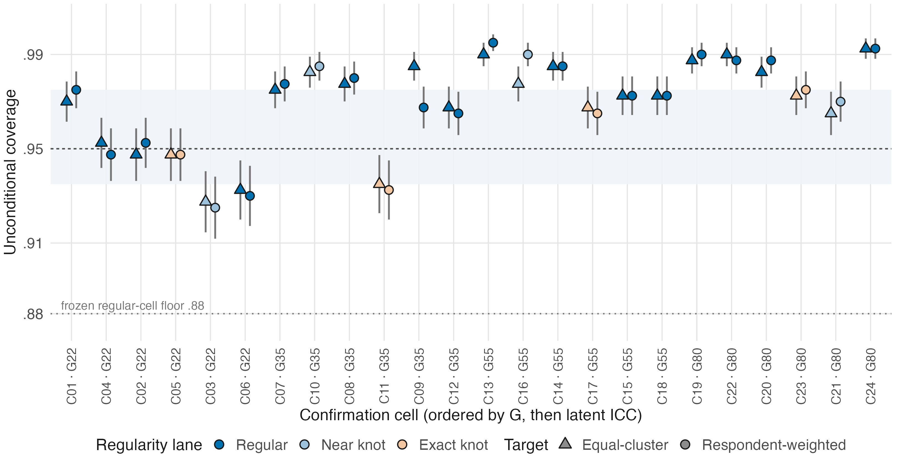
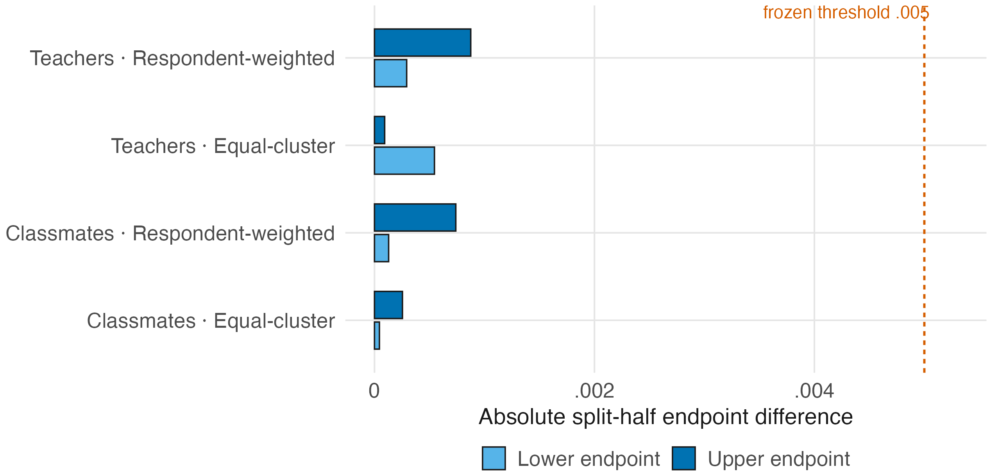

# The exhibits

All 15, rebuilt in about five seconds:

```bash
Rscript exhibits/00_build_all.R
```

Machine-readable: `provenance/reproduction-map.csv` and
`provenance/manuscript-artifact-contract.csv`, which `verify_semantics.R`
asserts agree in both directions.

Floats are compared **byte for byte**; figures by page geometry plus a
**150-dpi render hash**, because quartz embeds a timestamp in every PDF. The
target is the published manuscript build.

---

## Figures

### Figure 1 — the interval, end to end



`01_fig1_concept.R`, reading one of the 12 application draw streams
(99,999 draws) directly. Shows the HBB distribution of H and the calibrated
interval that tightens the raw one.

### Figure 2 — the confirmation design



The 24 cells over cluster count *G* and latent ICC.

### Figure 3 — coverage



Coverage by cell, **with the two population targets shown separately** — never
pooled, because they are different population quantities.

### Figure 4 — the calibration



Panel (a) shows the Phase 15 training path over the frozen
`gamma_cluster` candidates; `-1.5` was the shortest eligible candidate. Panel
(b) shows fresh Phase 16 confirmation coverage by *G* and cluster-size
mechanism. For the selected negative constant,
`k_G = 1 - 1.5/sqrt(G)` **increases toward 1 as G increases**; the figure does
not plot the held-out Phase 15 validation tier.

### Figure 5 — the SWMDK application



Both targets, side by side, with the comparators.

### Figure F1 — all 48 cell-target rows



Derived from the 86,400 raw replication rows and cross-checked against the
locked regular-cell artifact at 1e-12.

### Figure G1 — split-half stability



Maximum split-half discrepancy 8.75e-4 — small relative to an interval about
0.096 wide.

---

## The floats

All eight byte-identical to the published `.tex`.

| File | Printed as | Content |
|---|---|---|
| `tab2_confirmation.tex` | Table 1 | Phase 16 coverage and length by lane and target |
| `tab3_swmdk.tex` | Table 2 | the SWMDK application summary |
| `tabE1_training.tex` | Table E1 | the Phase 15 training tier |
| `tabE2_validation.tex` | Table E2 | the Phase 15 held-out validation tier |
| `tabF1_cells.tex` | Table F1 | all 48 confirmation cell-target rows |
| `tabF2_comparators.tex` | Table F2 | comparator intervals |
| `tabG1_categories.tex` | Table G1 | SWMDK category structure |
| `tabH1_claims.tex` | Table H1 | **the frozen claim-eligibility register** |

::: {.callout-note}
## Presentational edits live in the generator

Four floats carry changes the combined arXiv build made to fit its 6-inch
measure: `adjustbox` wrappers on `tab2`, `tab3` and `tabF2`, and rebalanced
column widths on `tabH1`. `tab3` additionally retargets one note pointer from
"Appendix G of the online supplement" to `\cref{app:swmdk}`, because the
combined build has no separate supplement.

All four are self-documented in the float headers, and none touches a value, a
column or a note. `07_tables.R` emits them so this package reproduces the floats
the paper actually prints.
:::

::: {.callout-important}
## Table H1 is a governance artifact

The claim-eligibility register is not an ordinary results table. Its 14 claims
were frozen at the source-review gate and govern what the article is allowed to
say — including CL-03, which requires the predecessor credit to Andreadis
(2017). `verify_semantics.R` asserts all 14 are transcribed.
:::

## The ledger

`outputs/key_numbers.csv` — 144 keys, **byte-identical** to the manuscript's,
SHA-256 `6a42e7352e455ff0…`, the constant the manuscript's own verifier carries.

Every generator asserts its displayed headline values against it before writing.
